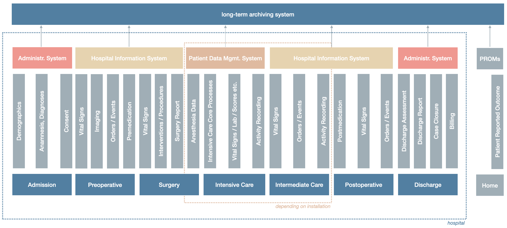

Hospital Data Ecosystem
===================================

A hospital is a complex multi-disciplinary institution with a wide variety of business and supporting processes resulting in a large data ecosystem. The scope of the Clinical Data Bible is limited to clinical data. Financial data or other data categories are out of scope.

The following figure illustrates an abstraction of a sample pathway in a hospital with associated data, processes and systems:

Systems
------------
Primary/secondary systems, registries, etc.

**Hospital Information System (HIS)**
    | The hospital information system is the main system for the clinical data in a hospital and serves as the "source-of-truth" for the longitudinal patient record with clinical routine data gathered either directly in the hospital information system or in department/clinic specific solutions. A set of interfaces ensures that the data gathered in other systems is feeded into the hospital information system. 
    | Typically the policy in a hospital is that each data set potentially relevant for the treatment of the patient must be fed into the system. Other data that is not directly relevant for the treatment process might also reside outside the hospital information system (refer to e.g. registries, studies, etc.). 
    | The following non-exhaustive list gives an overview over the data normally included in the HIS:

    * Patient Demographics
        * Name, Birthdate, Gender
        * Social Security Number
        * ...
    * Appointments
    * Orders and Events / Interventions
        * Medication
        * Installation (e.g. Catheter)
        * ...
    * Vital Signs & Scores
        * Blood Pressure
        * Temperature
        * ...
    * Lab Results
        * Chlinical Chemistry
        * Hematology
        * Virology
        * Microbiology
        * ...
    * Assessments
    * Diagnoses & Procedures
    * Reports
        * Admission / Discharge Reports
        * Clinical Notes
        * Prescriptions
        * Pathology Reports
        * ...
    * Images
        * Conventional X-Ray
        * CT / MRI
        * Ultrasound
        * Wound Documentation
        * ...

**Administrative System**
    | The administrative system (often an Enterprise Resource Planning System) holds the financial/billing information and typically also is the master system for the patient demographics.

**Laboratory Information System (LIS)**

**Radiology Information System (RIS)**

**Picture Archiving and Communication System (PACS)**

**Patient Data Management System**

**Long-Term Archiving System**

Data Types
------------
Structured vs. Unstructured
Imaging
Genomics

Data Models / Structure
------------

